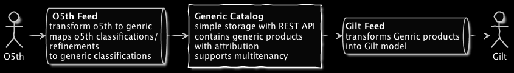
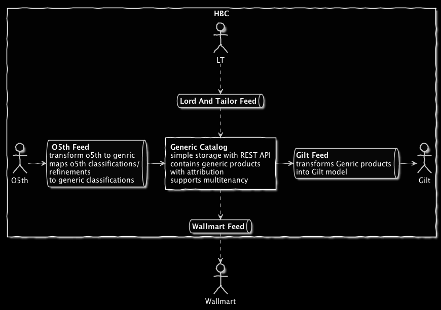
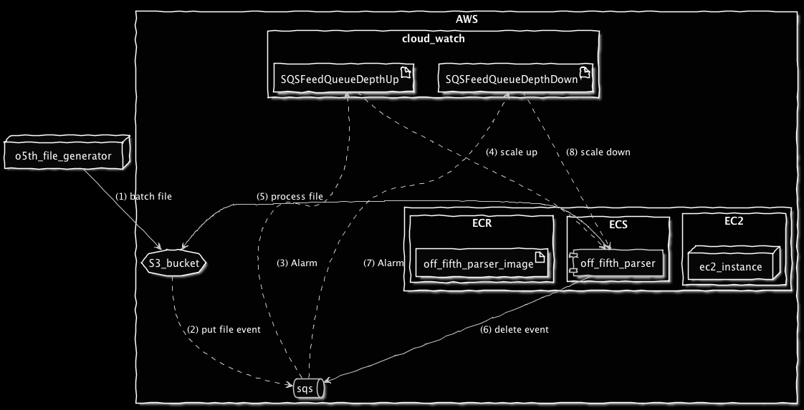
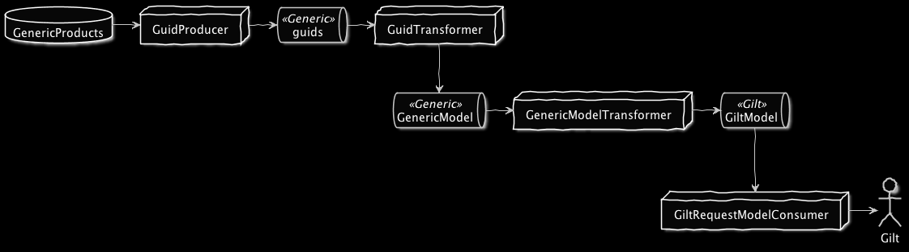
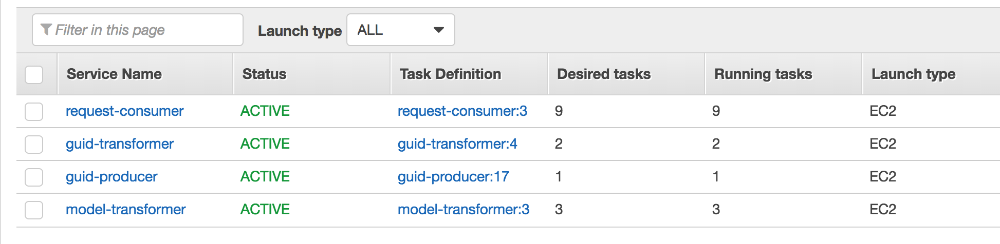
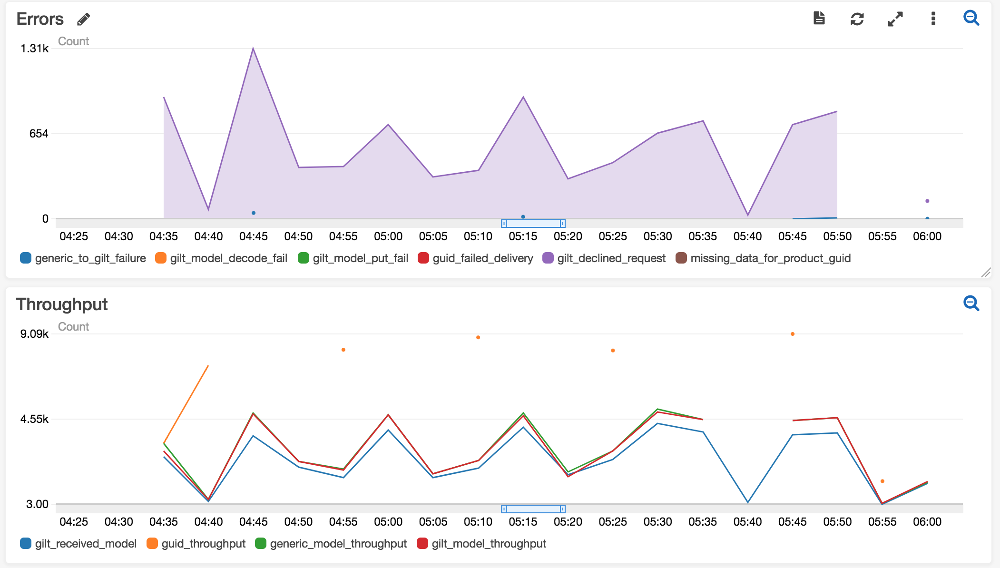

# Gilt

### Shared Inventory Technical Overview

---

## Tips!

<br>

@fa[arrows gp-tip](Press F to go Fullscreen)

@fa[microphone gp-tip](Press S for Speaker Notes)

---

## Main Components

- Generic Catalog |
- Off Fifth Products Feed |
- Gilt Products Feed |
- Inventory Integrator |

---

## Technologies Used

- Scala |
- PostgreSQL |
- AWS |
- Akka-Stream |
- Circe |
- Play |
- Make |
- Alpakka |
- Docker |

---
#### Top Level Diagram


---
#### Next State


---
#### Off Fifth Products Feed Diagram



---

@title[Product Parser]

<p><span class="slide-title">Product Parser</span></p>

```scala
def parser: Graph[FlowShape[Message, Payload[T]], NotUsed] =
  GraphDSL.create() { implicit builder =>
    import GraphDSL.Implicits._
    val s3_gateway = builder.add(Flow[Message]
      .map(s3EventToFileNames)
      .flatMapConcat(Source.apply)
      .flatMapConcat(fileToStreamSource)
    )
    val framer = builder.add(
      Framing.delimiter(ByteString(Properties.lineSeparator),
      maximumFrameLength = 10240,
      allowTruncation = true))
    val broadcast = builder.add(Broadcast[ByteString](2))
    val decoder = builder.add(CirceStreamSupport.decode[T])
    val raw = builder.add(Flow[ByteString].map(_.utf8String))
    val zipper = builder.add(Zip[String, T]())

    s3_gateway ~> framer ~> broadcast ~> raw     ~> zipper.in0
                            broadcast ~> decoder ~> zipper.in1

    val out = zipper.out.map { case (raw, parsed) =>
      Payload(ev.identity(parsed),
        raw, None,
        Some(parsed),
        batch_type)
    }

    FlowShape(s3_gateway.in, out.outlet)
}
```

@[18-20](desing file parsing graph)
@[4-7](convert s3 file put event into byte stream)
@[9-16](prepare graph flows)
@[21-26](zip json and raw into payload)
@[28](fuse graph into single component)

---

@title[Payload Processor]

<p><span class="slide-title">Payload Processor</span></p>

```scala
def changeTracker: Graph[FlowShape[Payload[T], Payload[T]], NotUsed] =
  GraphDSL.create() { implicit builder =>
    import GraphDSL.Implicits._

    val deriveStatus: FlowShape[Payload[T], Payload[T]] =
      builder.add(Flow[Payload[T]]
      .map { payload =>
        val (status, hash) = models.deriveMsgStatus(payload)
        payload.copy(status = Some(status), hash = hash)
      })

    val partition = builder.add(
      Partition[Payload[T]](2, { payload: Payload[T] =>
      payload.status match {
        case Some(models.New | models.Changed) => 0
        case _ => 1
      }
    }))

    val produce = builder.add(Flow[Payload[T]].log("new-or-updated")
      .via(catalogGateway))
    val skip = builder.add(Flow[Payload[T]]
      .log("unchanged-or-malformed"))
    val merge = builder.add(Merge[Payload[T]](2))

    deriveStatus ~> partition ~> produce ~> merge
                    partition ~> skip    ~> merge

    FlowShape(deriveStatus.in, merge.out)
  }
```

@[26-27](processing graph)
@[5-10](payload status)
@[12-18](partitioning)
@[19-24](produce or skip and merge)
@[29](fuse graph into single component)

---

@title[Put It All Together]

<p><span class="slide-title">Put It All Together</span></p>

```scala
def generic: Graph[FlowShape[Message, Payload[T]], NotUsed] =
  GraphDSL.create() { implicit builder =>
    import GraphDSL.Implicits._
    val parserFlow = builder.add(parser)
    val changeTrackerFlow = builder.add(changeTracker)

    parserFlow ~> changeTrackerFlow

    FlowShape(parserFlow.in, changeTrackerFlow.out)
  }
```
---
#### Gilt Feed

---

#### Gilt Feed ECS cluster

---

#### How Do We Scale
```bash
DESIRED_SIZE ?= 2
scale-service:
	( cd $(SERVICE) && ecs-cli compose --region $(REGION) \
    --cluster gilt-pipe-$(ENV) \
    --aws-profile $(AWS_DEFAULT_PROFILE)
    --file $(SERVICE)-$(ENV).yaml \
    service scale $(DESIRED_SIZE) )
```
---

#### How Do We Monitor

---

#### Lessons Learned
- Use AWS native streaming services (Kinesis, SQS, SNS) |
- Push logs to CloudWatch |
- Create Dashboards and filters for monitoring |
- Dockerise your services |
- Make AWS stacks reproducible by scripting (Makefile) and CloudFormation |
- Restrict developers to change generated code (API Builder) |

---

#### Special thanks
- Liya Aizenberg |
- Sam Sabo |
- Michael Lee |
- Christopher Poenaru |
- Rob Brazier |
- Hanuma Munjuluri |
- Gilt Tech Community |

---
### Questions?

<br>

@fa[twitter gp-contact](@semenodm)

@fa[github gp-contact](semenodm)

@fa[gmail gp-contact](dsemenov@gilt.com)

---?image=assets/image/gitpitch-audience.jpg&opacity=100

@title[Thank You!!!]

### Thank You !!!

